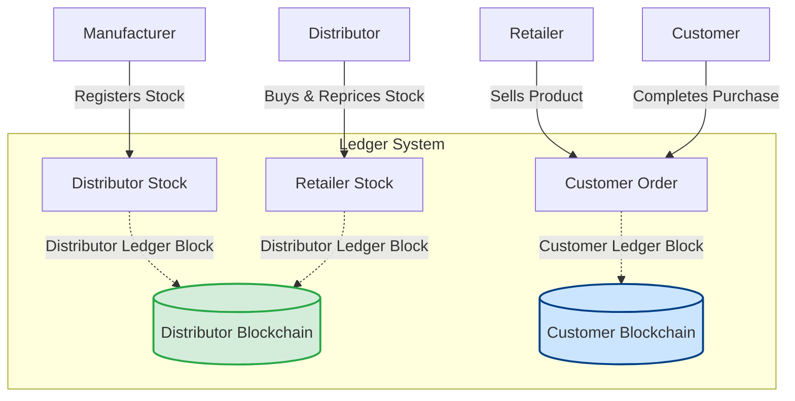

# 🔗 Blockchain-Enabled Supply Chain Management System

A multi-tier, decentralized, and transparent supply chain management platform built using **Python** and **Django**. This system secures transaction logs across the product lifecycle—from production to delivery—using a custom, database-backed **Proof-of-Work (PoW) Blockchain Ledger**.

It establishes a reliable chain of custody across four main participant roles: **Manufacturers**, **Distributors**, **Retailers**, and **Customers**.

---

## 🏗️ System Architecture & Data Flow

This application structure establishes a clear hierarchy of product ownership, transitioning stocks downward while registering transactions to the ledger:



### 📦 Key Models & Relational Structure
All core entities and structural relations are defined in [core/models.py](file:///d:/SIH/SupplyChain/SupplyChain/supplychain/core/models.py):
* **[User](file:///d:/SIH/SupplyChain/SupplyChain/supplychain/core/models.py#L247)**: Extends Django's `AbstractUser` to support role-based categorization (`MANUFACTURER`, `DISTRIBUTOR`, `RETAILER`, `CUSTOMER`, `ADMIN`), phone numbers, and optional UPI QR Code configuration.
* **[ManufacturerProduct](file:///d:/SIH/SupplyChain/SupplyChain/supplychain/core/models.py#L272)**: Represents products newly fabricated by a manufacturer, defining `base_price`, `min_quantity`, and `available_quantity`.
* **[DistributorStock](file:///d:/SIH/SupplyChain/SupplyChain/supplychain/core/models.py#L281)**: Represents stock acquired by a distributor from a manufacturer, carrying a distinct transaction ID verified on the ledger.
* **[RetailerStock](file:///d:/SIH/SupplyChain/SupplyChain/supplychain/core/models.py#L288)**: Represents products listed by a retailer, derived from their purchases from distributor stocks.
* **[Order](file:///d:/SIH/SupplyChain/SupplyChain/supplychain/core/models.py#L295)**: Tracks user purchases linked with specific retailer stocks.
* **[Transaction](file:///d:/SIH/SupplyChain/SupplyChain/supplychain/core/models.py#L304)**: Logs single exchange operations, tracking quantities, parties, chain type (`CUSTOMER` or `DISTRIBUTOR`), and hash references.
* **[Block](file:///d:/SIH/SupplyChain/SupplyChain/supplychain/core/models.py#L338)**: Represents a single ledger block, packaging a collection of `Transaction` records, previous block hash reference, and a Proof-of-Work confirmation integer.

---

## 🔒 Custom Proof-of-Work Blockchain Engine

The core ledger integrity logic is situated in [core/blockchain.py](file:///d:/SIH/SupplyChain/SupplyChain/supplychain/core/blockchain.py) inside the **[Blockchain](file:///d:/SIH/SupplyChain/SupplyChain/supplychain/core/blockchain.py#L200)** class:

* **Proof-of-Work (PoW)**: Uses a cryptographic mining process requiring the system to find a numerical proof $p$ such that the SHA-256 hash of the string concatenated with the previous block's proof results in a hash starting with **four leading zeros** (`0000`).
* **Multi-Chain Design**: The ledger splits transactions into separate database-backed chains based on type:
  * **`DISTRIBUTOR` Chain**: Tracks business-to-business (B2B) handoffs (Manufacturer $\rightarrow$ Distributor $\rightarrow$ Retailer).
  * **`CUSTOMER` Chain**: Tracks business-to-consumer (B2C) sales (Retailer $\rightarrow$ Customer).
* **Cryptographic Tamper Detection**: The `valid_chain` method systematically iterates through the historical chain, verifying block hashes and previous pointers to identify and flag database anomalies or unauthorized changes.

---

## 👥 Role-Based Portals & Dashboards

Access-restricted workflows are managed through tailored views in [core/views.py](file:///d:/SIH/SupplyChain/SupplyChain/supplychain/core/views.py):

### 🏭 1. Manufacturer Portal
* **Inventory Control**: Manufacturers can add, update, and delete active products ([ManufacturerProductForm](file:///d:/SIH/SupplyChain/SupplyChain/supplychain/core/forms.py#L40)).
* **Distributor Onboarding**: Manually register authorized distributors using [DistributorSignUpForm](file:///d:/SIH/SupplyChain/SupplyChain/supplychain/core/forms.py#L59) to establish restricted B2B partner ecosystems.
* **Sales Ledger**: Displays a complete, real-time ledger of stocks sold to distributors, backed by cryptographic block headers.

### 🚚 2. Distributor Portal
* **Procurement**: Purchase available manufacturer goods. Procurement uses a double-confirmation mechanism (`confirm_distributor_stock` view) that prompts the distributor to enter payment reference numbers before finalizing transaction blocks.
* **Stock Management**: Track prices and available inventory balances. Reprice stock for resale to retailer channels.

### 🏪 3. Retailer Portal
* **B2B Sourcing**: View and purchase inventory items listed by active distributors.
* **Storefront Management**: Set retailer retail prices and quantities, exposing products directly to the public home catalog page.
* **Dual Ledgers**: Split transaction panel listing customer sales alongside distributor purchases.

### 👤 4. Customer Portal
* **Storefront**: Browse products listed by retailers.
* **Checkout Integration**: Seamless checkouts featuring UPI QR Code support.
* **Integrity View**: Transparently review purchases. Each purchase displays details of the specific ledger block where the transaction is archived.

---

## 🛠️ Installation & Setup

Follow these instructions to run the application locally on a development machine.

### 📋 Prerequisites
* Python 3.8 or higher installed.
* Pip (Python package manager).

### ⚙️ Steps

1. **Clone the Repository**
   ```bash
   git clone <repository_url>
   cd supplychain
   ```

2. **Establish a Virtual Environment**
   * **Windows (PowerShell)**:
     ```powershell
     python -m venv venv
     .\venv\Scripts\Activate.ps1
     ```
   * **macOS/Linux**:
     ```bash
     python -m venv venv
     source venv/bin/activate
     ```

3. **Install Dependencies**
   Install the libraries specified in [requirements.txt](file:///d:/SIH/SupplyChain/SupplyChain/supplychain/requirements.txt):
   ```bash
   pip install -r requirements.txt
   ```

4. **Initialize the Database Schema**
   Apply database migrations to configure the SQLite setup:
   ```bash
   python manage.py migrate
   ```

5. **Establish Administrative Access (Optional)**
   Create a superuser to access the Django Administration panel:
   ```bash
   python manage.py createsuperuser
   ```

6. **Execute the Local Web Server**
   ```bash
   python manage.py runserver
   ```
   Open your browser and navigate to `http://127.0.0.1:8000/` to interact with the platform.

---

## 🛠️ Testing

The project is preconfigured to use `pytest` for validation. Run testing suites using:
```bash
pytest
```

---

## 🔗 Route Map (URL Architecture)

All URLs are mapped in [core/urls.py](file:///d:/SIH/SupplyChain/SupplyChain/supplychain/core/urls.py):

| URL Pattern | View Function | Description |
| :--- | :--- | :--- |
| `/` | `home` | Core catalog page |
| `/login/` | `login_view` | Unified portal entry |
| `/register/customer/` | `register_customer` | Customer sign-up page |
| `/register/retailer/` | `register_retailer` | Retailer sign-up page |
| `/manufacturer/dashboard/` | `manufacturer_dashboard` | Primary manufacturer panel |
| `/manufacturer/add_product/` | `add_product` | Add product page |
| `/distributor/dashboard/` | `distributor_dashboard` | Primary distributor panel |
| `/distributor/add_stock/<id>/` | `add_to_distributor_stock` | Initiates manufacturer procurement |
| `/retailer/dashboard/` | `retailer_dashboard` | Primary retailer panel |
| `/buy/<id>/` | `buy_product` | Final customer checkout page |

---

## 🛡️ Django Admin Optimization
The admin system is customized in [core/admin.py](file:///d:/SIH/SupplyChain/SupplyChain/supplychain/core/admin.py):
* **Custom User Admin**: The [CustomUserAdmin](file:///d:/SIH/SupplyChain/SupplyChain/supplychain/core/admin.py#L286) manages specialized roles.
* **Block Admin**: The [BlockAdmin](file:///d:/SIH/SupplyChain/SupplyChain/supplychain/core/admin.py#L304) displays chain types, proofs, hashes, and includes a link to query transactions contained within specific blocks.
* **Transaction Admin**: Customized listing showing counterparties, formats, status flags, and block indices.
